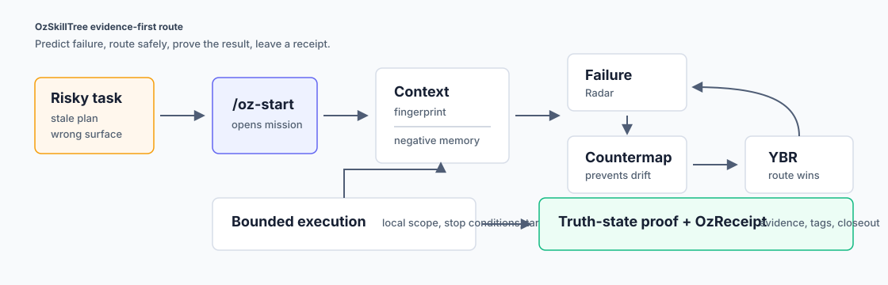

# oz-skilltree

[](https://github.com/cipherholdingsllc/oz-skilltree/actions/workflows/ci.yml)

v0.1 edition · Apache-2.0

**AI coding agents fail when execution outruns evidence. `oz-skilltree` is a protocol that makes the failure predictable, counterable, and provable — before the edit, not after the incident.**

It is a docs-first, schema-backed execution protocol for AI-assisted software work: predict likely failures, choose a safe route, verify the result, leave an auditable receipt. AI speed with senior-engineer foresight.



## Why AI Coding Agents Fail

- wrong repo, worktree, branch, or package boundary
- stale plan reuse after new evidence appears
- false green builds or stale deploy status
- skipped acceptance criteria or weak verification
- overbroad edits that solve one issue and create another
- public/private boundary mistakes
- completion summaries that collapse `claimed` into `verified`

`oz-skilltree` turns those failure modes into predictable routing work.

## Prove It in 60 Seconds

Zero dependencies. Clone and run the full verification suite:

```sh
git clone https://github.com/cipherholdingsllc/oz-skilltree.git
cd oz-skilltree
npm test
```

Example output (structure validation, link integrity, leak scan, stable surfaces, structural evals):

```
schemas valid; checked 16 schemas and 34 example JSON files (schema-derived, registry modes/budgets)
doc links valid; checked 87 markdown files
local leak-pattern extension loaded
private leak check passed; scanned 151 files
stable surfaces intact; 5 commands, 8 skills, 16 schemas, 6 modes, count claims present
structural evals passed; 65 assertions green
```

Then open the flagship worked example — [agent-drift-recovery](examples/agent-drift-recovery/) — and read the receipt chain end to end.

## How Much Overhead Is This, Really?

The protocol scales with stakes. Heavy modes are opt-in, not default.

| Mode | When | Counter budget | Feel |
|---|---|---|---|
| `scan` | low-risk, reversible | 3–5 | seconds |
| `standard` | ordinary repo/docs task | 10–15 | a short pre-flight |
| `standard+` | first proof-test, deployment blocker, high round-trip cost | 15–20 | a careful pre-flight |
| `deep-lite` | incomplete evidence or unclear state, no hard contradiction | 20–25 | minutes |
| `deep` | integration, multi-file, repeated blocker | 25–35 | minutes, deliberately |
| `max` | production, auth, secrets, privacy, healthcare claims, database, public launch | 35–50 | the deploy you cannot afford to botch |

Mode doctrine version: **v0.2 (six-mode)**. `failure-radar-max` must not be weakened.

## Protocol Loop

| Step | Question | Output |
|---|---|---|
| gate | Does this deserve a mission at all? ([Forward Gate](docs/forward-gate.md), when go/no-go is unclear) | proceed / plan_first / ask / defer / reject |
| frame | What is the goal, lane, source of truth, and approval ceiling? | OzReceipt draft |
| retrieve | What do prior receipts and negative memory already know about this kind of work? | retrieval block (mandatory at start) |
| generate | What weak, mediocre, good, and strong routes exist? | calibrated candidate universe |
| score | Which routes are real A/A+ options? | route candidates |
| predict | What can fail? | Failure Radar |
| counter | What prevents, diagnoses, repairs, verifies, or rolls back failure? | Countermap |
| route | Which route wins on safety, reversibility, scope, and proof? | YBR route |
| build | What changes inside the route? | files and commands |
| verify | What is actually proved? | truth-state update with proof contract |
| close | What did we learn? | `/oz-result` + failure-inbox drain |

Start with [docs/protocol.md](docs/protocol.md) or the Obsidian entry point at [wiki/Home.md](wiki/Home.md).

## Command Map

| Command | Job | Receipt behavior |
|---|---|---|
| `/oz-start` | Start a serious goal: retrieval gate, mode, counters, route | only command that creates new OzReceipts |
| `/oz` | One-response upgrade, repair, comparison, compression, judgment, or pathfinding pass | continuation-only; halts without one active receipt |
| `/oz-result` | Closeout, truth-state update, failure-inbox drain | attaches to one active receipt or halts |
| `/oz-handoff` | Compress an active receipt into a brief any fresh session can resume | attaches to one active receipt or halts |
| `/bug-cognizant` | Future-build-aware architecture prediction | does not create receipts; hands serious work to `/oz-start` |

If no active OzReceipt exists, continuation-only work halts with `NO_ACTIVE_OZRECEIPT`. If multiple active receipts exist, it halts with `AMBIGUOUS_ACTIVE_OZRECEIPT`. Halting instead of improvising is the design.

Command docs: [commands/](commands/). Skill docs: [skills/](skills/). Session continuity (failure inbox, checkpoints, handoffs): [docs/session-continuity.md](docs/session-continuity.md).

## Skeptic FAQ

**Is this just ceremony?** Scan mode is a seconds-level pre-flight; the heavy modes exist for work where a wrong edit costs hours or trust. The mode table above is the honest overhead contract.

**Where's the proof it works?** No public benchmark results are claimed — see [benchmarks/README.md](benchmarks/README.md) for the methodology, and [field-receipts/](field-receipts/) for the (currently empty by design) sanitized field-receipt pipeline. The repo's own verification suite runs in CI on every change; what is claimed is checkable.

**Truth states are an honor system, aren't they?** No — each state carries a proof contract ([wiki/Truth-States.md](wiki/Truth-States.md)): `verified` requires a command and exit code, `pushed` requires the remote ref, `deployed` requires a hash match. A state without its proof is reported one rung lower.

**What happens when a session crashes mid-task?** Checkpoints and handoff briefs ([docs/session-continuity.md](docs/session-continuity.md)) bound the loss to roughly one step, and the failure inbox catches the errors that would otherwise vanish with the terminal.

**Will this bloat my context window?** The protocol budgets itself: structural evals enforce a size ratchet on every command and skill surface, CI-checked.

## Receipt Memory

OzReceipts are the memory layer. They record: goal, lane, repo context fingerprint, source of truth, approval ceiling, retrieval block, selected mode, top failure families, countermap, route, stop conditions, files changed, commands run, verification evidence with proof contracts, truth-state movement, negative memory, and future retrieval tags.

See [docs/receipt-memory.md](docs/receipt-memory.md) and [wiki/templates/ozreceipt.md](wiki/templates/ozreceipt.md).

## Public Failure Atlas

`oz-skilltree` is informed by a source-locked Failure Atlas maintained outside the public-safe branch. This repository includes public-safe protocol surfaces, schemas, examples, and boundary notes derived from that research discipline — not the raw taxonomy.

Derived docs must preserve: 42 stable failure families · 16 stable counter family IDs · `failure-radar-max` · `countermap-50` · full YBR route schema · OzReceipt and `/oz-result` schemas · public/private classification · stop conditions and no-runtime boundaries. The stable public surfaces are machine-guarded by [registry/stable-surfaces.json](registry/stable-surfaces.json) + `npm test`.

Boundary notes: [research/public-failure-atlas/](research/public-failure-atlas/).

## Examples

Examples are sanitized fixtures. They do not include fake logs, fake users, fake benchmark results, or fake deploy outcomes.

| Example | Shows |
|---|---|
| [agent-drift-recovery](examples/agent-drift-recovery/) | stale-plan, wrong-surface, public/private boundary, and false-completion recovery |
| [vercel-build-failure](examples/vercel-build-failure/) | basic deep-mode build-failure routing without deploy claims |
| [bug-cognizant-dashboard-module](examples/bug-cognizant-dashboard-module/) | future-build architecture prediction before implementation |
| [pr-review-routing-split](examples/pr-review-routing-split/) | separating PR review, verification, and optional patch work |

## Schemas and Scripts

Schemas live in [schemas/](schemas/) (OzReceipt, `/oz-result`, Failure Radar, Countermap, YBR route, Bug-Cognizant, Failure Atlas metadata). Scripts live in [scripts/](scripts/) — including the [context fingerprint](scripts/context-fingerprint.mjs) pre-flight that stamps repo/branch/HEAD/lockfile state into every receipt.

## Non-Goals

`oz-skilltree` is not: an autonomous agent · a runtime, app, server, dashboard, MCP, or telemetry system · a deployment tool · a benchmark-result claim · a security, compliance, medical, legal, or financial guarantee · a zero-bug guarantee · a replacement for human approval on high-risk work.

Deferred unless explicitly approved later: OzLedger activation, agent-harness activation, local-model workflows, and runtime activation.

## Roadmap

1. Keep the protocol docs small, navigable, and boundary-aware (size-ratchet enforced in CI).
2. Collect real, sanitized OzReceipts from representative coding tasks → publish to `field-receipts/` in batches.
3. Calibrate failure-family ranking against actual receipts once the corpus matures.
4. Strengthen examples and schema fixtures without claiming benchmark results.
5. Agent supervision harness (workspace package) after the mechanism layer is proven.

---

<p align="center"><em>frame → retrieve → predict → counter → route → build → verify → close.</em><br>
<strong>Predict failure. Route safely. Prove the result. Leave a receipt.</strong></p>
