# OzSkillTree Map

```mermaid
flowchart LR
    A["/oz-start"] --> R["Retrieval Gate"]
    R --> B["Failure Radar"]
    B --> C["Countermap-50"]
    C --> D["Pathfinder"]
    D --> E["YellowBrickRoad"]
    E --> F["Execution"]
    F --> G["Verification"]
    G --> H["/oz-result + Inbox Drain"]
    H --> I["OzReceipt"]
    I --> J["Future retrieval"]
```

Plain text fallback:

`/oz-start -> Retrieval Gate -> Failure Radar -> Countermap-50 -> Pathfinder -> YellowBrickRoad -> Execution -> Verification -> /oz-result + Inbox Drain -> OzReceipt -> Future retrieval`
